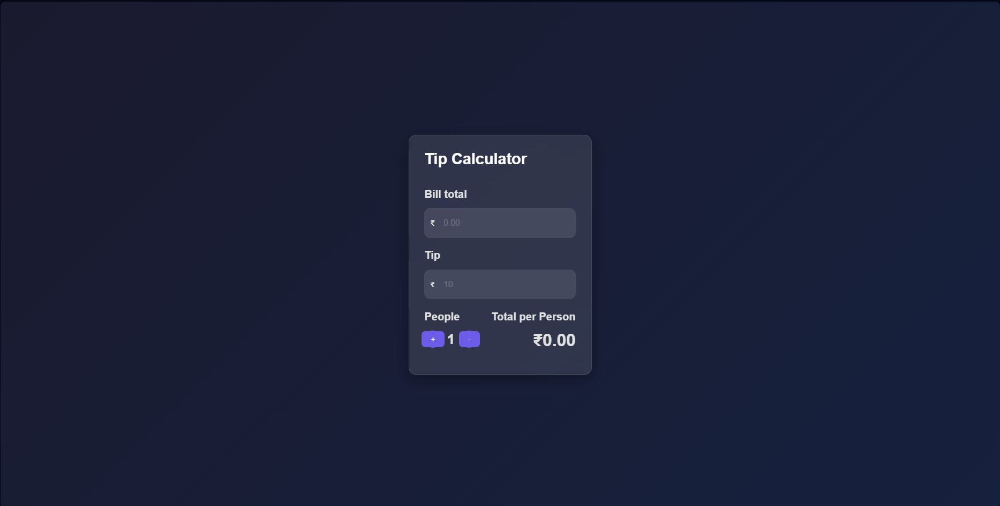

# 💰 Tip Calculator

A simple and minimalistic tip calculator to help you split the bill with friends or family. 🍕🍻 Built using HTML, CSS, and JavaScript.

---
## 📸 Screenshot

## ✨ Features

- **💵 Bill Total Input**: Enter the total bill amount.
- **💡 Tip Percentage Input**: Specify the tip percentage you'd like to give.
- **👥 Split Bill**: Adjust the number of people to split the bill between.
- **🧮 Total per Person**: Automatically calculates the total amount each person should pay.

---

## 🚀 How to Use

1. Enter the total bill amount in the **"Bill total"** field.
2. Enter the tip percentage you'd like to give in the **"Tip"** field.
3. Use the **"+"** and **"-"** buttons to adjust the number of people splitting the bill.
4. The **"Total per Person"** field will automatically update to show how much each person should pay.

---

## 🛠️ Technologies Used

- **📄 HTML**: Structure of the application.
- **🎨 CSS**: Styling and layout.
- **⚙️ JavaScript**: Logic for calculating the bill and updating the DOM.

---

## 🤝 Contributing
Contributions are welcome! 🙌 If you have any suggestions or improvements, feel free to open an issue or submit a pull request.